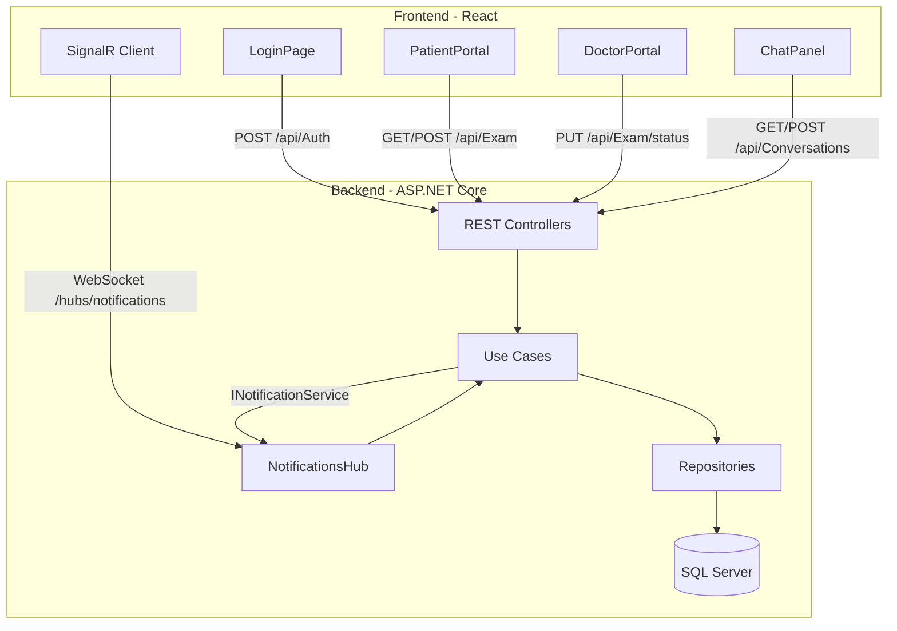
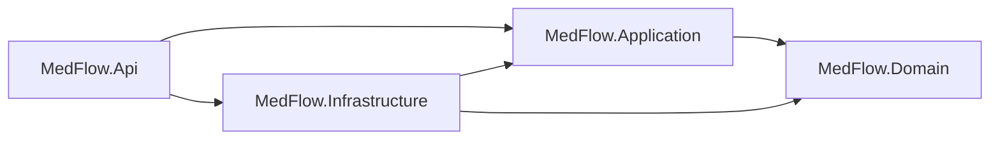
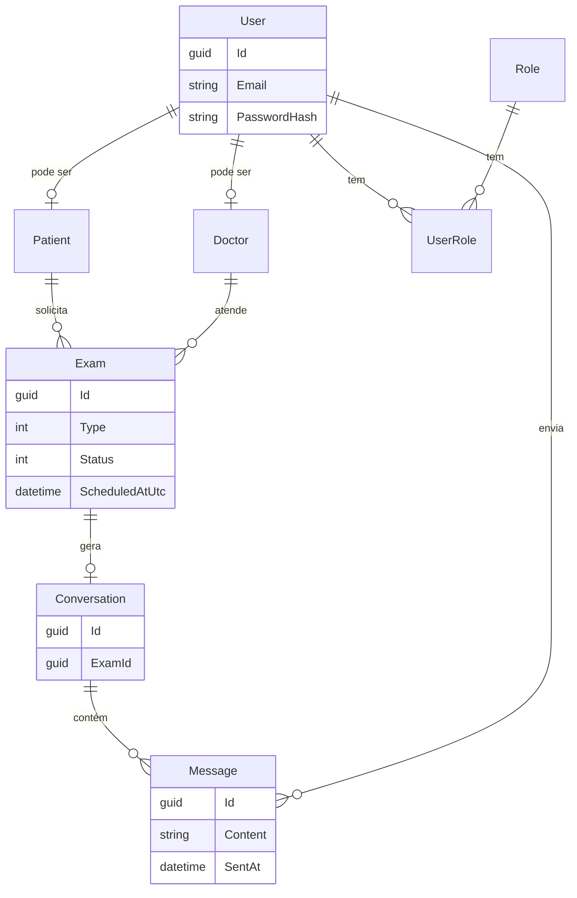
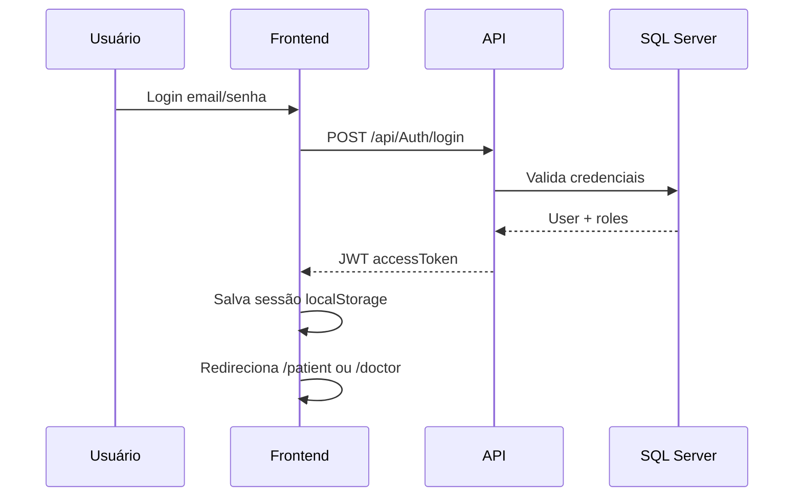
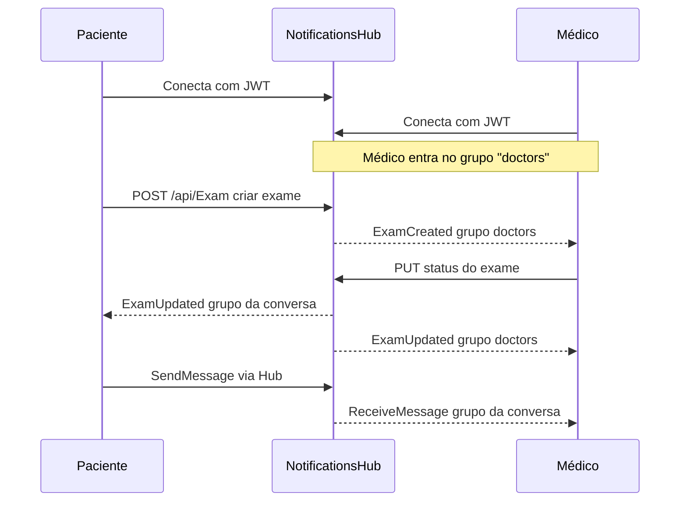

# MedFlow

Plataforma para gestão de exames médicos com portais separados para **pacientes** e **médicos**, chat por exame e notificações em tempo real via SignalR.

O projeto é um monorepo com backend em **.NET** (Clean Architecture) e frontend em **React + TypeScript**.

---

## Funcionalidades

| Área | O que faz |
|------|-----------|
| **Autenticação** | Registro e login com JWT; perfis `Patient` e `Doctor` |
| **Exames** | Paciente solicita exames; médico visualiza a fila e atualiza status |
| **Conversas** | Cada exame pode ter uma conversa vinculada (paciente ↔ médico) |
| **Chat** | Histórico via REST + mensagens em tempo real via SignalR |
| **Notificações** | Médicos recebem `ExamCreated` na fila; ambos recebem `ExamUpdated` e `ReceiveMessage` |

---

## Arquitetura geral



---

## Camadas do backend



| Projeto | Responsabilidade |
|---------|------------------|
| **MedFlow.Api** | Controllers REST, Swagger, CORS, SignalR Hub, JWT |
| **MedFlow.Application** | Use cases, contratos (DTOs), interfaces de repositório |
| **MedFlow.Domain** | Entidades, enums (`ExamType`, `ExamStatus`) |
| **MedFlow.Infrastructure** | EF Core, SQL Server, autenticação, repositórios |

---

## Modelo de domínio



### Status de exame

| Valor | Nome | Descrição |
|-------|------|-----------|
| `0` | Requested | Solicitado pelo paciente |
| `1` | InProgress | Em análise pelo médico |
| `2` | Completed | Concluído |
| `3` | Cancelled | Cancelado |

### Tipos de exame

`BloodTest`, `XRay`, `Ultrasound`, `MagneticResonanceImaging`, `ComputedTomography`, `Electrocardiogram`

---

## Fluxo de autenticação



O token JWT inclui claims: `sub`, `email`, `roles`, `patientId` ou `doctorId`.

---

## Tempo real (SignalR)

**Endpoint:** `ws://localhost:5113/hubs/notifications` (ou via proxy do Vite em dev)



### Eventos do Hub

| Evento | Quem recebe | Quando |
|--------|-------------|--------|
| `ExamCreated` | Grupo `doctors` | Novo exame na fila |
| `ExamUpdated` | `doctors` + conversa do exame | Status alterado |
| `ReceiveMessage` | Grupo da conversa | Nova mensagem |

### Métodos do Hub (cliente → servidor)

- `JoinConversation(conversationId)`
- `LeaveConversation(conversationId)`
- `SendMessage(conversationId, content)`

---

## Stack tecnológica

### Backend
- .NET 10 / ASP.NET Core
- Entity Framework Core + SQL Server
- JWT Bearer Authentication
- SignalR
- Swagger (OpenAPI)

### Frontend
- React 19 + TypeScript
- Vite 6
- React Router 7
- `@microsoft/signalr`
- CSS global (sem framework de UI)

### Testes
- `MedFlow.Infrastructure.Tests` (xUnit + EF Core InMemory/SQLite)

---

## Estrutura do repositório

```
MedFlow/
├── src/
│   ├── api/
│   │   ├── MedFlow.Api/           # Host, controllers, SignalR
│   │   ├── MedFlow.Application/   # Use cases e contratos
│   │   ├── MedFlow.Domain/        # Entidades e enums
│   │   ├── MedFlow.Infrastructure/# EF Core, auth, repos
│   │   └── MedFlow.sln
│   └── web/
│       ├── src/
│       │   ├── pages/             # Login, PatientPortal, DoctorPortal
│       │   ├── components/        # ChatPanel, PortalLayout, Feedback
│       │   ├── auth/              # AuthContext, ProtectedRoute
│       │   ├── api/               # Cliente REST (medflowApi)
│       │   └── realtime/          # Hook useMedFlowHub
│       └── vite.config.ts         # Proxy /api e /hubs → :5113
├── tests/
│   └── MedFlow.Infrastructure.Tests/
└── docs/
    └── estudo/                    # Material de estudo
```

---

## Pré-requisitos

- [.NET SDK 10](https://dotnet.microsoft.com/download)
- [Node.js 20+](https://nodejs.org/) e npm
- **SQL Server** local (ou Express / LocalDB)
- (Opcional) Visual Studio / VS Code / Cursor

---

## Como rodar

### 1. Banco de dados (primeira vez)

Ajuste a connection string em `src/api/MedFlow.Api/appsettings.json` se necessário:

```json
"ConnectionStrings": {
  "Database": "Server=localhost;Database=MedFlow;Trusted_Connection=True;TrustServerCertificate=True;MultipleActiveResultSets=true"
}
```

Aplique as migrations:

```powershell
dotnet ef database update `
  --project src\api\MedFlow.Infrastructure\MedFlow.Infrastructure.csproj `
  --startup-project src\api\MedFlow.Api\MedFlow.Api.csproj
```

### 2. API (terminal 1)

```powershell
cd src\api\MedFlow.Api
dotnet watch run
```

| URL | Descrição |
|-----|-----------|
| http://localhost:5113/swagger | Documentação da API |
| http://localhost:5113/hubs/notifications | Hub SignalR |

Para HTTPS também (`https://localhost:7026`):

```powershell
dotnet watch run --launch-profile https
```

### 3. Frontend (terminal 2)

```powershell
cd src\web
npm install
npm run dev
```

Abra **http://localhost:5173**

Em desenvolvimento, o Vite faz **proxy** de `/api` e `/hubs` para `localhost:5113` — não é preciso configurar CORS manualmente no front.

### 4. Testar o fluxo

1. Acesse `/login`
2. Registre um usuário **Patient** e outro **Doctor** (ou use contas de teste se existirem)
3. Como paciente: solicite um exame em `/patient`
4. Como médico: veja a fila em `/doctor`, atualize o status e use o chat

---

## API REST (resumo)

Todas as rotas abaixo de `/api/Exam` e `/api/Conversations` exigem header:

```
Authorization: Bearer {seu_token_jwt}
```

| Método | Rota | Role | Descrição |
|--------|------|------|-----------|
| `POST` | `/api/Auth/register` | — | Criar conta |
| `POST` | `/api/Auth/login` | — | Obter JWT |
| `GET` | `/api/Exam` | Patient / Doctor | Listar exames do usuário |
| `POST` | `/api/Exam` | Patient | Criar exame |
| `PUT` | `/api/Exam/{id}/status` | Doctor | Atualizar status |
| `GET` | `/api/Conversations` | Patient / Doctor | Listar conversas |
| `GET` | `/api/Conversations/{id}/messages` | Patient / Doctor | Histórico de mensagens |
| `POST` | `/api/Conversations/{id}/messages` | Patient / Doctor | Enviar mensagem (REST) |

---

## Frontend — rotas

| Rota | Componente | Acesso |
|------|------------|--------|
| `/` | Redireciona para portal ou login | Público |
| `/login` | LoginPage | Público |
| `/patient` | PatientPortal | Role `Patient` |
| `/doctor` | DoctorPortal | Role `Doctor` |

---

## Scripts úteis

### Backend

```powershell
# Compilar solution
dotnet build src\api\MedFlow.sln

# Rodar testes
dotnet test tests\MedFlow.Infrastructure.Tests\MedFlow.Infrastructure.Tests.csproj
```

### Frontend

```powershell
cd src\web

npm run dev      # Desenvolvimento
npm run build    # Build de produção
npm run lint     # ESLint
npm run preview  # Preview do build
```

---

## Variáveis de ambiente (frontend)

Arquivo `src/web/.env.development`:

```env
# Vazio = usa proxy do Vite (/api e /hubs → localhost:5113)
VITE_MEDFLOW_API_URL=
```

Em produção, defina a URL completa da API:

```env
VITE_MEDFLOW_API_URL=https://sua-api.exemplo.com
```

---

## Configuração JWT (backend)

`src/api/MedFlow.Api/appsettings.json`:

```json
"Jwt": {
  "Issuer": "MedFlow",
  "Audience": "MedFlow",
  "SecretKey": "...",
  "AccessTokenExpirationMinutes": 60
}
```

> Em produção, use `SecretKey` forte via variável de ambiente ou User Secrets — nunca commite segredos reais.

---

## Solução de problemas

| Problema | Causa provável | Solução |
|----------|----------------|---------|
| `Failed to fetch` no login | API offline | Rode `dotnet watch run` e confirme `localhost:5113` |
| Erro de conexão SQL | Banco não existe | Rode `dotnet ef database update` |
| SignalR não conecta | Token ausente ou API parada | Faça login de novo; verifique proxy no Vite |
| CORS em produção | Origem não permitida | Configure `Cors:AllowedOrigins` no `appsettings` |

